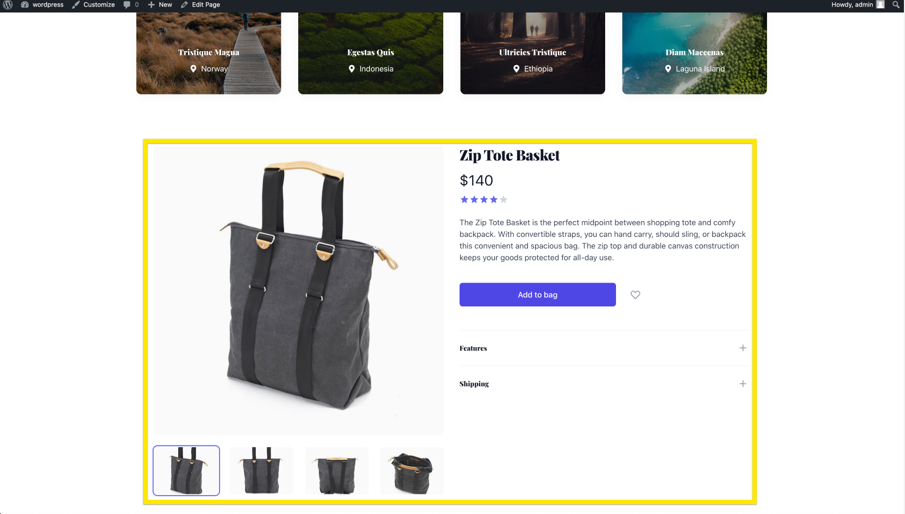

# Tutorial 1

## Embedded React + Tailwind Widget

In this tutorial we'll learn how to create an embedded react widget using the following technologies:

- [React Js](https://reactjs.org/)
- [Tailwind CSS](https://tailwindcss.com/)
- [Vite Js](https://vitejs.dev/) (A Super-Fast Frontend Dev Server & Bundler)

A screenshot of what we'll create:


## Setup

#### 1. Project Scaffolding (run the commands that applies)

```bash
# npm 6.x
npm create vite@latest tutorial1 --template react

# npm 7+, extra double-dash is needed:
npm create vite@latest tutorial1 -- --template react

# yarn
yarn create vite tutorial1 --template react

# pnpm
pnpm create vite tutorial1 -- --template react
```

#### 2. Let's install the dependencies & start vitejs dev server

```bash
 cd tutorial1
 npm install

 # if you're using VS-Code as your editor then open the project by running:
 code .

 # then start vitejs dev server
 npm run dev
```

#### 3. Install Tailwind CSS

##### 3.1 Initialize the project to use TailwindCSS

```bash
npm install -D tailwindcss postcss autoprefixer
npx tailwindcss init -p
```

##### 3.2 Copy the following lines in your tailwind.config.js file

```js
# copy paste in [ProjectRoot]/tailwind.config.js

module.exports = {
  content: ["./index.html", "./src/**/*.{vue,js,ts,jsx,tsx}"],
  theme: {
    extend: {},
  },
  plugins: [
    require("@tailwindcss/typography"),
    require("@tailwindcss/aspect-ratio"),
  ],
};
```

##### 3.3 Replace the content of vite.config.js with the following

```js
import { defineConfig } from "vite";
import react from "@vitejs/plugin-react";
import path from "path";

module.exports = defineConfig({
  plugins: [react()],
  build: {
    lib: {
      entry: path.resolve(__dirname, "src/main.jsx"),
      name: "LiftedWP-Widgets",
      fileName: (format) => `liftedwp-widgets.${format}.js`,
    },
  },
});
```

##### 3.4 Add the following settings to your package.json

```json
{
  // add the following 
  "name": "liftedwp-widgets",
  "files": ["dist"],
  "main": "./dist/liftedwp-widgets.umd.js",
  "module": "./dist/liftedwp-widgets.es.js",
  "exports": {
    ".": {
      "import": "./dist/liftedwp-widgets.es.js",
      "require": "./dist/liftedwp-widgets.umd.js"
    }
  }

 // & leave everything else the same ...
 
}
```

##### 3.5 Install the newly added dependencies

```bash
npm install @headlessui/react @heroicons/react react-icons @tailwindcss/aspect-ratio @tailwindcss/typography
```

##### 3.6 Add the Tailwind directives to your CSS

Create (or replace if already existing) a **./src/index.css** file and add the @tailwind directives for each of Tailwind’s layers.

```css
@tailwind base;
@tailwind components;
@tailwind utilities;
```

##### 3.7 Let's create an html element styled with Tailwind to test everything works

- Replace the content of the **./src/App.jsx** file with the following:

```jsx
function App() {
  return (
    <span class="inline-flex items-center px-3 py-0.5 rounded-full text-sm font-medium bg-blue-100 text-blue-800">
      It works.
    </span>
  );
}

export default App;
```

- You may have to restart vitejs dev server by closing and running this command again:

```bash
npm run dev
```

## Creating an embeddable e-commerce product widget

##### 1. Scaffolding

```bash
mkdir src/widgets src/components src/data
```

```bash
touch src/widgets/index.js src/widgets/Product.jsx
touch src/components/Product.jsx
touch src/data/products.js
```

##### 2. Index.html

replace the following line

```html
<div id="root"></div>
```

with the following

```html
<div
  class="liftedwp-widget"
  data-widget-name="Product"
  data-product-id="1"
></div>
```

##### 2. src/main.jsx

replace the whole content with the following

```jsx
import React from "react";
import {createRoot} from 'react-dom/client'
import App from "./App";
import "./index.css";

// Find all widget divs
const WidgetDivs = document.querySelectorAll(".liftedwp-widget");

// Render our React App into each
WidgetDivs.forEach((Div) => {
  const reactDiv = createRoot(Div)
  reactDiv.render(
    <React.StrictMode>
      <App domElement={Div} />
    </React.StrictMode>,
    Div
  );
});
```

##### 3. src/App.jsx

replace the whole content with the following

```jsx
import React from "react";
import * as widgets from "./widgets";

function App({ domElement }) {
  // 1. Retrieve all the html data-* attributes passed down to the widget;
  const dataset = Object.assign({}, domElement.dataset);

  // 2. One of them is the name of the widget itself, needed to render the right widget.
  const Widget = widgets[dataset.widgetName];

  // 3. Call the selected widget and pass down all the data-* attributes.
  return <Widget dataset={dataset} />;
}

export default App;
```

##### 4. src/data/products.js

replace the whole content with the following

```js
// Simulate products database
// we'll soon replace with real data coming from a Headless CMS
const products = [
  {
    id: 1,
    name: "Zip Tote Basket",
    price: "$140",
    rating: 4,
    images: [
      {
        id: 1,
        name: "Angled view",
        src: "https://tailwindui.com/img/ecommerce-images/product-page-03-product-01.jpg",
        alt: "Angled front view with bag zipped and handles upright.",
      },
      {
        id: 2,
        name: "Angled view",
        src: "https://tailwindui.com/img/ecommerce-images/product-page-03-product-02.jpg",
        alt: "Angled front view with bag zipped and handles upright.",
      },
      {
        id: 3,
        name: "Angled view",
        src: "https://tailwindui.com/img/ecommerce-images/product-page-03-product-03.jpg",
        alt: "Angled front view with bag zipped and handles upright.",
      },
      {
        id: 4,
        name: "Angled view",
        src: "https://tailwindui.com/img/ecommerce-images/product-page-03-product-04.jpg",
        alt: "Angled front view with bag zipped and handles upright.",
      },
      // More images...
    ],
    description: `
      <p>The Zip Tote Basket is the perfect midpoint between shopping tote and comfy backpack. With convertible straps, you can hand carry, should sling, or backpack this convenient and spacious bag. The zip top and durable canvas construction keeps your goods protected for all-day use.</p>
    `,
    details: [
      {
        name: "Features",
        items: [
          "Multiple strap configurations",
          "Spacious interior with top zip",
          "Leather handle and tabs",
          "Interior dividers",
          "Stainless strap loops",
          "Double stitched construction",
          "Water-resistant",
        ],
      },
      {
        name: "Shipping",
        items: [
          "Free shipping on orders over $300",
          "International shipping available",
          "Expedited shipping options",
          "Signature required upon delivery",
        ],
      },
      // More sections...
    ],
  },
  // More products...
];

export function getProductById(productId) {
  // later this will be replaced by a graphql query to a Headless CMS
  const id = parseInt(productId);
  const found = products.filter((product) => product.id == id);
  if (found.length) return found[0];

  //error log if no product found
  console.error(`No product found for productId=[${productId}]`);
  return null;
}
```

##### 5. src/widgets/Product.jsx

replace the whole content with the following

```js
import ProductComponent from "../components/Product";
import { getProductById } from "../data/products";

export function Product({ dataset }) {
  console.log(dataset);
  const { productId } = dataset;
  const product = getProductById(productId);
  return product && <ProductComponent product={product} />;
}
```

##### 5. src/components/Product.jsx

replace the whole content with the following

```js
import { Disclosure, Tab } from "@headlessui/react";
import { StarIcon } from "@heroicons/react/solid";
import { HeartIcon, MinusSmIcon, PlusSmIcon } from "@heroicons/react/outline";

function classNames(...classes) {
  return classes.filter(Boolean).join(" ");
}

export default function Product({ product }) {
  return (
    <div className="bg-white">
      <div className="max-w-2xl mx-auto py-16 px-4 sm:py-24 sm:px-6 lg:max-w-7xl lg:px-8">
        <div className="lg:grid lg:grid-cols-2 lg:gap-x-8 lg:items-start">
          {/* Image gallery */}
          <Tab.Group as="div" className="flex flex-col-reverse">
            {/* Image selector */}
            <div className="hidden mt-6 w-full max-w-2xl mx-auto sm:block lg:max-w-none">
              <Tab.List className="grid grid-cols-4 gap-6">
                {product.images.map((image) => (
                  <Tab
                    key={image.id}
                    className="relative h-24 bg-white rounded-md flex items-center justify-center text-sm font-medium uppercase text-gray-900 cursor-pointer hover:bg-gray-50 focus:outline-none focus:ring focus:ring-offset-4 focus:ring-opacity-50"
                  >
                    {({ selected }) => (
                      <>
                        <span className="sr-only">{image.name}</span>
                        <span className="absolute inset-0 rounded-md overflow-hidden">
                          
                        </span>
                        <span
                          className={classNames(
                            selected ? "ring-indigo-500" : "ring-transparent",
                            "absolute inset-0 rounded-md ring-2 ring-offset-2 pointer-events-none"
                          )}
                          aria-hidden="true"
                        />
                      </>
                    )}
                  </Tab>
                ))}
              </Tab.List>
            </div>

            <Tab.Panels className="w-full aspect-w-1 aspect-h-1">
              {product.images.map((image) => (
                <Tab.Panel key={image.id}>
                  
                </Tab.Panel>
              ))}
            </Tab.Panels>
          </Tab.Group>

          {/* Product info */}
          <div className="mt-10 px-4 sm:px-0 sm:mt-16 lg:mt-0">
            <h1 className="text-3xl font-extrabold tracking-tight text-gray-900">
              {product.name}
            </h1>

            <div className="mt-3">
              <h2 className="sr-only">Product information</h2>
              <p className="text-3xl text-gray-900">{product.price}</p>
            </div>

            {/* Reviews */}
            <div className="mt-3">
              <h3 className="sr-only">Reviews</h3>
              <div className="flex items-center">
                <div className="flex items-center">
                  {[0, 1, 2, 3, 4].map((rating) => (
                    <StarIcon
                      key={rating}
                      className={classNames(
                        product.rating > rating
                          ? "text-indigo-500"
                          : "text-gray-300",
                        "h-5 w-5 flex-shrink-0"
                      )}
                      aria-hidden="true"
                    />
                  ))}
                </div>
                <p className="sr-only">{product.rating} out of 5 stars</p>
              </div>
            </div>

            <div className="mt-6">
              <h3 className="sr-only">Description</h3>

              <div
                className="text-base text-gray-700 space-y-6"
                dangerouslySetInnerHTML={{ __html: product.description }}
              />
            </div>

            <form className="mt-6">
              {/* Colors */}

              <div className="mt-10 flex sm:flex-col1">
                <button
                  type="submit"
                  className="max-w-xs flex-1 bg-indigo-600 border border-transparent rounded-md py-3 px-8 flex items-center justify-center text-base font-medium text-white hover:bg-indigo-700 focus:outline-none focus:ring-2 focus:ring-offset-2 focus:ring-offset-gray-50 focus:ring-indigo-500 sm:w-full"
                >
                  Add to bag
                </button>

                <button
                  type="button"
                  className="ml-4 py-3 px-3 rounded-md flex items-center justify-center text-gray-400 hover:bg-gray-100 hover:text-gray-500"
                >
                  <HeartIcon
                    className="h-6 w-6 flex-shrink-0"
                    aria-hidden="true"
                  />
                  <span className="sr-only">Add to favorites</span>
                </button>
              </div>
            </form>

            <section aria-labelledby="details-heading" className="mt-12">
              <h2 id="details-heading" className="sr-only">
                Additional details
              </h2>

              <div className="border-t divide-y divide-gray-200">
                {product.details.map((detail) => (
                  <Disclosure as="div" key={detail.name}>
                    {({ open }) => (
                      <>
                        <h3>
                          <Disclosure.Button className="group relative w-full py-6 flex justify-between items-center text-left">
                            <span
                              className={classNames(
                                open ? "text-indigo-600" : "text-gray-900",
                                "text-sm font-medium"
                              )}
                            >
                              {detail.name}
                            </span>
                            <span className="ml-6 flex items-center">
                              {open ? (
                                <MinusSmIcon
                                  className="block h-6 w-6 text-indigo-400 group-hover:text-indigo-500"
                                  aria-hidden="true"
                                />
                              ) : (
                                <PlusSmIcon
                                  className="block h-6 w-6 text-gray-400 group-hover:text-gray-500"
                                  aria-hidden="true"
                                />
                              )}
                            </span>
                          </Disclosure.Button>
                        </h3>
                        <Disclosure.Panel
                          as="div"
                          className="pb-6 prose prose-sm"
                        >
                          <ul role="list">
                            {detail.items.map((item) => (
                              <li key={item}>{item}</li>
                            ))}
                          </ul>
                        </Disclosure.Panel>
                      </>
                    )}
                  </Disclosure>
                ))}
              </div>
            </section>
          </div>
        </div>
      </div>
    </div>
  );
}
```

## Bundling an embedding our widget into a WordPress site

### 1. Creating the widget

Run the following command to create the widget's embeddable files

```bash
npm run build
```

The command above will create the following files:

```bash
❯ npm run build

> liftedwp-widgets@0.0.0 build
> vite build

vite v2.9.1 building for production...
✓ 496 modules transformed.
dist/style.css                22.33 KiB / gzip: 4.47 KiB
dist/liftedwp-widgets.es.js   292.36 KiB / gzip: 69.23 KiB
dist/liftedwp-widgets.umd.js   195.80 KiB / gzip: 58.70 KiB
```

### 2. Embedding our widget

##### 2.1 Hosting the widget files on a static file server

The two files we'll consider are: - **liftedwp-widgets.umd.js** - **style.css**  
Copy these two files to a static file server, in this tutorial we'll simply store the files in the **wp-content** folder.

##### 2.2 Embedding the widget (finally)

- Create an empty WordPress page or edit an existing one
- Add the following lines to the **\<head>** element (several WordPress plugins & themes allow you to embed css and js to a page)

```html
<head>
  <!-- Leave the rest of the content unchage, simply add the two lines below -->
  <script
    type="module"
    src="[YOUR-DDOMAN]/wp-content/liftedwp-widgets.umd.js"
  ></script>
  <link rel="stylesheet" href="[YOUR-DDOMAN]/wp-content/style.css" />
</head>
```

- Add the widget anywhere in the body of the page

```html
<div
  class="liftedwp-widget"
  data-widget-name="Product"
  data-product-id="1"
></div>
```
